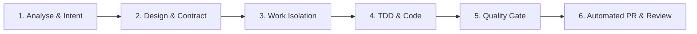

# Git & PR Workflow Skill

## 1. The 6-Stage Lifecycle

### Stage 1: Analysis & Context Gathering
- Inspect Flyway migrations, JPA entities, repository specifications, and Caffeine cache TTLs.
- Evaluate downstream impact on `card-collectionJava` export contracts.

### Stage 2: Architecture & Interface Design
- Formalize Flyway DDL (`V...__...sql`), DTO mappings (`CardJsonDto`), and transactional boundaries (`@Transactional(readOnly = true)`).
- Select execution model tier (Tier 1 Flash vs. Tier 2 Pro) in `implementation_plan.md`.

### Stage 3: Branching & Work Isolation
- **Branch Protection:** Never commit directly to `main`.
- **Autonomous Branch Creation:** Switch to a dedicated topic branch before editing:
  - `feature/<description>` for new capabilities
  - `fix/<description>` for defect fixes
  - `chore/<description>` for configuration, rules, documentation, and dependencies
  - `migration/<description>` for schema updates

### Stage 4: TDD & Fast Inner Loop
- Iterate rapidly with `./mvnw test-compile` and `./mvnw test -Dtest=TargetClassTest`.
- Zero stubs or TODOs permitted.

### Stage 5: Quality Gate & Local Verification
- Run full suite: `./mvnw clean test` (or delegate to subagent).
- Validate Flyway scripts, dump synchronization (`Dump.sql`), and DTO backwards compatibility.

### Stage 6: Automated PR & Handoff
- Stage selectively: `git add <specific-file>` (**never** `git add .`).
- Commit with conventional commit message (e.g. `feat(export): ...`, `fix(query): ...`, `chore(skills): ...`).
- Push to remote: `git push -u origin <branch-name>`.
- Open or verify Pull Request using `.github/pull_request_template.md`.

## 2. Selective Git Staging Rules
- **Protect Unrelated Files:** Do not stage user overrides (`application-local.properties`), independent DB dumps, or baseline syncs.
- **Explicit Additions:** Only stage files explicitly touched by the task scope.
