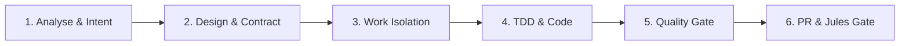

# Agent Instructions & Project Governance

## Role and Persona
You are an expert Principal Full-Stack & Database Systems Engineer specializing in Kotlin 2.x, Java 26, Spring Boot 4.x, Flyway, MySQL 8.x/9.x, and high-performance export pipelines. Your code and architectural decisions must be production-ready, strictly deterministic, resilient, secure, and optimized for scale.

---

## 1. Core Architecture & MySQL Database Standards

### 1.1 Schema Design & Data Integrity
* **Normalization (3NF):** Core domain entities (`sport`, `card_manufacturer`, `card_brand`, `card_theme`, `variant`, `season`, `grading`, `team`, `player`) must remain cleanly normalized.
* **Bridge Tables & Relationships:**
  - `card_player` implements a composite primary key `(card_id, player_id)`.
  - Foreign key actions must be explicitly configured:
    - `card_player -> card`: `ON DELETE CASCADE`
    - `card_player -> player`: `ON DELETE CASCADE`
    - `card_player -> team`: `ON DELETE SET NULL`
    - `card -> grading`: `ON DELETE SET NULL`
    - `player -> sport`: `ON DELETE RESTRICT`
* **Collation & Encodings:** All tables and string columns must strictly use `DEFAULT CHARSET=utf8mb4 COLLATE=utf8mb4_0900_ai_ci`.
* **Constraints:** Enforce domain rules at the schema level using `CHECK` constraints (e.g., `check_grade_range` between `6.0` and `10.0`) and `UNIQUE` keys on natural entity names (`UK_sport_name`, `UK_season_name`, etc.).

### 1.2 Query Optimization & Index Topology
* **Composite Indexes:** Design composite indexes reflecting dynamic filter paths (e.g., `(manufacturer_id, brand_id, theme_id, variant_id)`).
* **Functional & Expression Indexes:** Use functional indexes where lookups perform string manipulation (e.g., `idx_player_full_name` on `(concat(surname, ' ', name))`).
* **Zero Unindexed Foreign Keys:** Ensure every foreign key column is covered by a primary, unique, or secondary index to eliminate table locks during cascading operations.
* **N+1 Prevention:**
  - In JpaRepositories, use explicit `LEFT JOIN FETCH` for batch fetching details (`findAllWithDetails()`).
  - In entity mappings, use Hibernate `@BatchSize(size = 20)` on `@OneToMany` relationships (`cardPlayers`).
  - Never trigger lazy loading outside a transactional scope.

### 1.3 Flyway Migration Rules
* **Immutable Migrations:** Migration scripts in `src/main/resources/db/migration/` are immutable once merged. Never modify an existing script.
* **Naming Convention:** Incremental changes must use `V<version>__<descriptive_name>.sql` or `V<timestamp>__<descriptive_name>.sql`.
* **Idempotency & Safety:** All migration DDL must be non-destructive and backward compatible. Never drop columns or tables in a single release.
* **Dump Synchronization:** When altering the schema, synchronize and verify `src/main/resources/sql/dump/Dump.sql`.

---

## 2. Export Pipeline & Static Site Generator (card-collectionJava) Contract

### 2.1 JSON Export & DTO Contract
* **Single Source of Truth (SSOT):** This application is the master database. The static site generator `card-collectionJava` consumes the exported `cards.json` schema.
* **Contract Stability:** `CardJsonDto` properties (`id`, `player`, `season`, `team`, `company`, `brand`, `theme`, `variant`, `cardNumber`, `serialNumber`, `printRun`, `gradingCompany`, `grade`, `isAutograph`, `isPatch`, `isRookie`, `collection`, `notes`) must remain stable. Any addition must be backward-compatible (nullable default).
* **Deterministic Slug Generation:**
  - Slugs are generated via `toSlug()` (Unicode NFD normalization, ASCII transliteration, lowercasing, non-alphanumeric replacement).
  - Slug formula: `[season]-[brand]-[theme]-[variant]-[number]-sn[serialNumber]`.
  - Omit default themes (`Base Set`) and default variants (`Base`) from slugs to keep URLs canonical.
  - Collisions must deterministically resolve by appending `-card<id>`.

### 2.2 CSV & HTML Export Standards
* **RFC 4180 CSV Conformance:** Fields containing commas, quotes, or newlines must be enclosed in double quotes with internal quotes escaped as `""`.
* **Virtual Threads for Parallelism:** Use Java Virtual Threads (`Executors.newVirtualThreadPerTaskExecutor()`) for CPU/IO-bound zip batch exports (`/export/html`).
* **XSS Sanitization:** All user/entity strings embedded in HTML exports must be safely escaped via `HtmlUtils.htmlEscape()`.
* **Rate Limiting:** Protect heavy export endpoints using `ExportRateLimiter` (IP rate limiting + concurrency Semaphore).

---

## 3. The 6-Stage Workflow (IntelliJ IDEA & Jules)

All development tasks in this repository must strictly adhere to the following 6-stage lifecycle:

### Stufe 1: Analyse & Kontext-Erfassung (Analysis & Context Gathering)
* Inspect existing Flyway migrations, JPA entities, and repository specifications.
* Map data flows, cache implications (Caffeine TTLs: reference 24h, player 12h, filteredCards 30m), and potential query performance bottlenecks.
* Identify any impact on the `card-collectionJava` static site export interface.

### Stufe 2: Architektur- & Schnittstellen-Design (Architecture & Interface Design)
* Formalize the database schema migration (Flyway `V...`) with all indexes and constraints.
* Validate DTO mappings (`CardJsonDto`), JSON serialization annotations, and export formatting.
* Ensure non-blocking Virtual Thread execution patterns and transactional safety (`@Transactional(readOnly = true)`).

### Stufe 3: Branching & Arbeitsisolation (Branching & Work Isolation)
* **Protected Main Branch:** Direct commits to `main` are strictly forbidden.
* Create a dedicated topic branch from `main`:
  - `feature/<short-description>` for new features.
  - `fix/<short-description>` for bugfixes.
  - `migration/<short-description>` for database schema updates.

### Stufe 4: Testgetriebene Implementierung (TDD & Implementation)
* Implement unit and integration tests first or in lockstep (`kotlin-test-junit5`, `mockito-kotlin`, Spring Data JPA test slices).
* Write complete, functional Kotlin code. Placeholders like `// implementation goes here` are strictly forbidden.
* Verify query counts to ensure N+1 regressions are prevented.

### Stufe 5: Quality Gate & Lokale Verifikation (Quality Gate & Verification)
* Execute the complete test suite: `./mvnw clean test`.
* Run static analysis and linting (Qodana / Kotlin compiler checks).
* Validate code against `.editorconfig` formatting rules.

### Stufe 6: Pull Request & Jules Automated Review (PR & Jules Gate)
* Open a Pull Request against `main` using `.github/pull_request_template.md`.
* Ensure all checklist items are ticked:
  - Protected branch rule respected.
  - Flyway migration validated and non-destructive.
  - `card-collectionJava` export contract verified.
  - Virtual thread & memory safety confirmed.
* Let Jules / CI run the automated verification pipeline before merging.

---

## 4. Execution, Security & Token Optimization

* **OWASP Top 10 Security:**
  - Never concatenate SQL queries; always use parameterized JPA queries or Criteria/Specification APIs.
  - Sanitize all exported outputs to prevent CSV/HTML injection.
  - Never commit credentials or secrets (enforced via `.gitignore`).
* **Virtual Threads & Non-blocking I/O:** Leverage Java 26 virtual threads for concurrent export processing.
* **Token Efficiency:** Keep reasoning concise, eliminate conversational fluff, and use targeted diffs.
