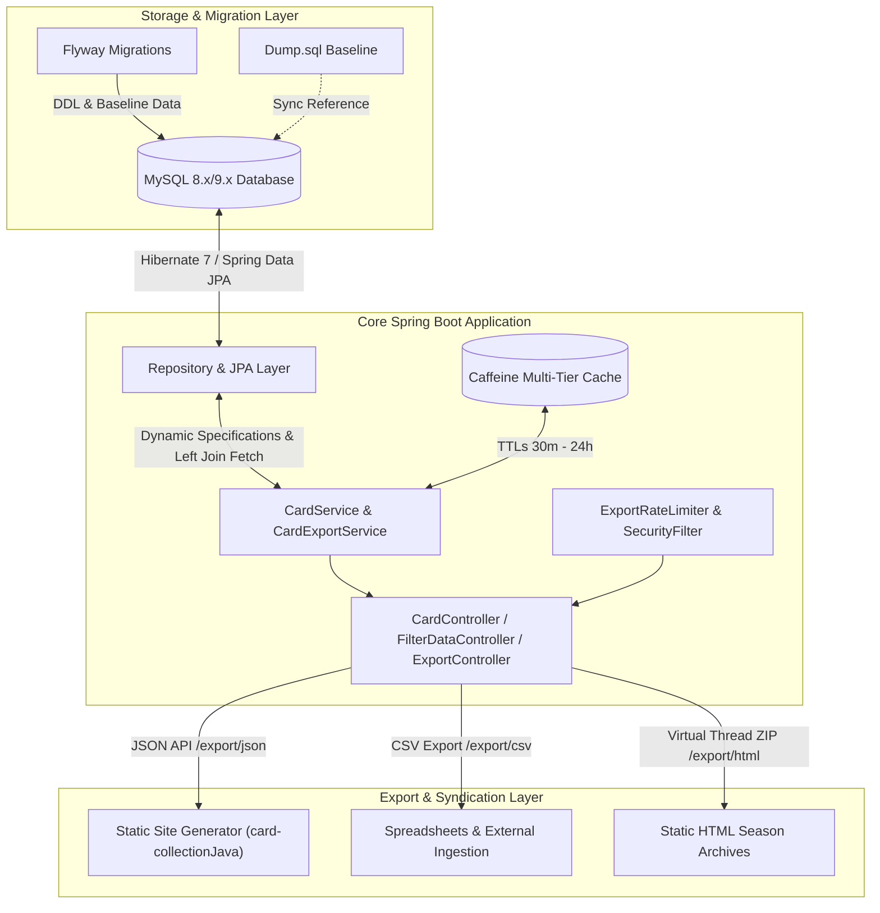
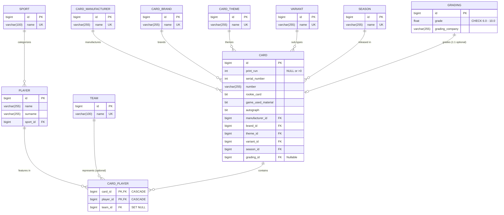
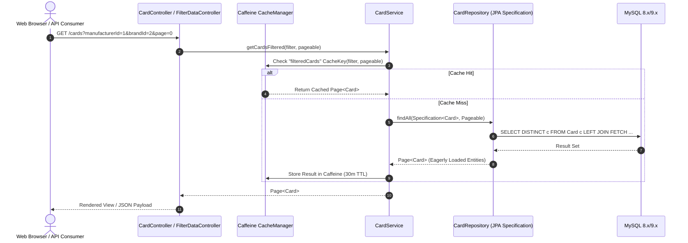

# Architectural Blueprint: Card Collection Engine

## 1. System Overview & Context

`card-collection` is a high-performance, domain-driven Spring Boot application written in Kotlin (running on Java 26) backed by a relational MySQL database. It serves as the **Single Source of Truth (SSOT)** for sports trading card inventory, advanced relational querying, and data syndication.

The application feeds structured data to the downstream static site generator **`card-collectionJava`**, which generates static collection catalogs, SEO-optimized landing pages, and interactive showcase portals.



---

## 2. Database Topology & Entity Schema

The database schema is fully normalized (Third Normal Form) with explicit domain constraints, index coverage for all foreign keys, and dedicated functional indexes for complex string matching.

### 2.1 Entity Relationship Diagram



### 2.2 Relational Integrity & Cascading Semantics

| Relationship | Cardinality | FK Constraint Action | Rationale |
| :--- | :--- | :--- | :--- |
| `card_player` $\rightarrow$ `card` | $N:1$ | `ON DELETE CASCADE` | Removing a card cascades to its player associations. |
| `card_player` $\rightarrow$ `player` | $N:1$ | `ON DELETE CASCADE` | Removing a player removes their links in card collections. |
| `card_player` $\rightarrow$ `team` | $N:1$ | `ON DELETE SET NULL` | Card link remains intact if a team entry is cleared. |
| `card` $\rightarrow$ `grading` | $1:1$ | `ON DELETE SET NULL` | Deleting a grading record keeps the physical card record. |
| `player` $\rightarrow$ `sport` | $N:1$ | `ON DELETE RESTRICT` | Prevents accidental deletion of a sport category in use. |
| `card` $\rightarrow$ `manufacturer/brand/theme/variant/season` | $N:1$ | `ON DELETE RESTRICT` | Preserves referential integrity for master domain lookups. |

### 2.3 Index Topology

```sql
-- Card Search & Dynamic Filter Composite Indexes
KEY `idx_card_mfg_brand_theme_variant` (`manufacturer_id`, `brand_id`, `theme_id`, `variant_id`)
KEY `idx_card_mfg_brand_theme` (`manufacturer_id`, `brand_id`, `theme_id`)
KEY `idx_card_attributes` (`rookie_card`, `game_used_material`, `autograph`)
KEY `idx_card_print_run` (`print_run`)
KEY `idx_card_number` (`number`)

-- Bridge & Functional Player Lookups
KEY `idx_player_full_name` ((concat(`surname`, ' ', `name`)))
KEY `idx_player_surname_name` (`surname`, `name`)
KEY `idx_card_player_player_card` (`player_id`, `card_id`)
KEY `idx_card_player_team_card` (`team_id`, `card_id`)
```

---

## 3. Data Processing & Export Pipelines

### 3.1 Synchronous Ingestion & Filter Flow



---

## 4. Export Interface Specification (SSG: card-collectionJava)

The static site generator `card-collectionJava` depends strictly on the `/export/json` endpoint and the stability of the `CardJsonDto` contract.

### 4.1 JSON Contract (`/export/json` $\rightarrow$ `cards.json`)

```json
[
  {
    "id": "1994-95-finest-refractors-230",
    "player": "Juwan Howard",
    "season": "1994-95",
    "team": "Washington Bullets",
    "company": "Topps",
    "brand": "Finest",
    "theme": "Base Set",
    "variant": "Refractors",
    "cardNumber": "230",
    "serialNumber": null,
    "printRun": null,
    "gradingCompany": "PSA",
    "grade": "10",
    "isAutograph": false,
    "isPatch": false,
    "isRookie": true,
    "collection": "Juwan Howard",
    "notes": null
  }
]
```

### 4.2 Deterministic Slug Formula

The unique identifier (`id`) in `CardJsonDto` is generated deterministically via `CardExportService`:

1. **Extraction:** Season $\rightarrow$ Brand $\rightarrow$ Theme (if $\neq$ "Base Set") $\rightarrow$ Variant (if $\neq$ "Base") $\rightarrow$ Number $\rightarrow$ Serial (prefix `sn` if $\neq 0$).
2. **Unicode Normalization:** Strip diacritics via `Normalizer.normalize(input, Normalizer.Form.NFD)`.
3. **Kebab-Case Sanitization:** Lowercase, replace all non-alphanumerics with `-`, collapse consecutive dashes.
4. **Collision Handling:** If a collision exists in the export batch, append `-card<id>`.

---

## 5. Performance, Concurrency & Caching Architecture

### 5.1 Caffeine Cache Tiers

```mermaid
graph TD
    subgraph Long-Term Reference Caches [TTL: 24 Hours | Max Size: 500]
        C1[sports]
        C2[seasons]
        C3[manufacturers]
        C4[teams]
        C5[brands]
        C6[themes]
        C7[variants]
    end

    subgraph Entity Cache [TTL: 12 Hours | Max Size: 1,000]
        C8[players]
    end

    subgraph Dynamic Query Cache [TTL: 30 Minutes | Max Size: 2,000]
        C9[filteredCards]
    end
```

### 5.2 Virtual Thread Export Parallelization

When exporting the entire collection partitioned by season (`/export/html`), the controller splits processing across Java 26 Virtual Threads:

```kotlin
Executors.newVirtualThreadPerTaskExecutor().use { executor ->
    cardsBySeason.entries.map { (seasonName, cards) ->
        executor.submit(Callable {
            seasonName to buildSeasonHtml(cards)
        })
    }.map { it.get() }
}
```

This ensures maximum CPU/IO utilization while streaming the resulting ZIP archive directly to the HTTP response stream with minimal memory overhead.

---

## 6. Security & Operational Governance

* **SQL Injection Immunity:** All dynamic queries use Spring Data `JpaSpecificationExecutor` and CriteriaBuilder. No string concatenation for queries.
* **Rate Limiting:** `ExportRateLimiter` enforces a dual-protection mechanism:
  - Max 20 export requests per minute per IP.
  - Max 10 concurrent heavy export processes via `Semaphore`.
* **Security Headers:** `SecurityHeadersFilter` applies OWASP-recommended headers:
  - `Content-Security-Policy: default-src 'self'`
  - `X-Content-Type-Options: nosniff`
  - `X-Frame-Options: DENY`
  - `Strict-Transport-Security: max-age=31536000; includeSubDomains`
